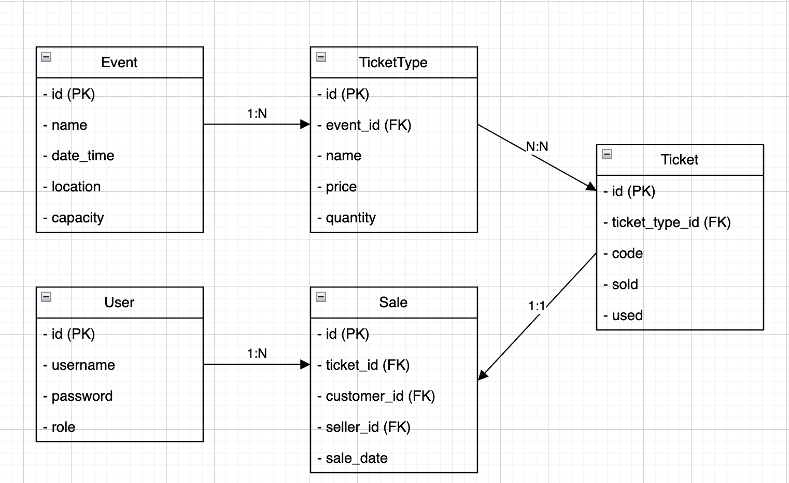

# TicketGuru-BittiPossut

## Johdanto 

Asiakkaamme on lipputoimisto, joka haluaa parantaa lippujen myyntiä heidän myyntipisteessään. Järjestelmän tarkoituksena on mahdollistaa sujuva lipunmyynti myyntipisteessä. Lipuissa on koodi, joka luetaan ovella, jonka avulla lippu voidaan merkata käytetyksi. Tarkoituksena on luoda järjestelmä, joka on selkeä ja nopea.   Tulevaisuudessa järjestelmään olisi tarkoitus lisätä myös verkkokauppa. 

### Sidosryhmät

- Lipputoimisto (asiakas/tilaaja)
- Lipunmyyjä (käyttäjä myyntipisteessä)
- Asiakas (lipun ostaja)
- Ylläpitäjä (järjestelmän hallinta )

## Järjestelmän määrittely

## Käyttötapaukset
Käyttötapauskaavio:


## Käyttöliittymäkaavio:


## Toiminnalliset vaatimukset

- Ylläpitäjä pystyy muokkaamaan, lisäämään ja poistamaan tapahtumia helposti. 
Tapahtumista on oltava saatavilla olennaiset tiedot kuten nimi, päivämäärä, kellonaika ja paikka. 

- Lipunmyyjä pystyy valitsemaan tietyn tapahtuman ja lipputyypin. 

- Liput pystyy tulostamaan ovella. 
- Lipuissa oleva koodi varmistaa, että lippu on aito ja se merkitään käytetyksi. 

### Ei-toiminnalliset vaatimukset

- Järjestelmän pitää olla helposti laajennettava tulevaisuuden verkkokauppa järjestelmää varten. 
- Selkeä ja helppokäyttöinen. 
- Järjestelmä tallentaa ja säilyttää käyttäjien tiedot turvallisesti. 

### Järjestelmän rajoitukset

- Aluksi järjestelmä tehdään vain  lippujen myynti myyntipisteessä, ei verkkokauppaa. 
- Lippujen on oltava tulostettavia.
- Lippujen tarkastus toimii tietyssä järjestelmässä. 

## Käyttäjäroolit
- Asiakas
- Myyjä
- Tarkastaja

## Käyttäjätarinat

### 1 tarina (asiakas)
> Asiakkaana haluan saada paperisen lipun, jossa on koodi, jotta voin todistaa ostaneeni lipun.

### 2 tarina (asiakas)
> Asiakkaana haluan ostaa lipun turvallisesti viralliselta myyntipisteeltä, jotta voin osallistua tapahtumaan.

### 3 tarina (myyjä)
> Myyjänä haluan kirjautua turvallisesti järjestelmään, jotta voin myydä ja palvella asiakkaita helposti.

### 4 tarina (myyjä)
> Myyjänä haluan nähdä paljonko lippuja on jäljellä, ja paljonko niitä on myyty. Helppo nähdä myös paljonko lippuja jää yli.

### 6 tarina (tarkastaja)
> Tarkastajana haluan skannata lipun koodin ovella, jotta voin merkitä lipun käytetyksi.

# Tietokanta

Tässä luvussa kuvataan järjestelmässä käytettävä tietokanta, sen rakenne ja taulujen väliset suhteet. Tietokanta tallentaa tiedot tapahtumista, lipuista, käyttäjistä ja myynnistä, jotta myyntipisteen toiminta ja lipun tarkastus voidaan hoitaa sujuvasti.

## 1. Yleiskuva tietokannasta
Tietokanta tukee lippujen myyntiä myyntipisteessä ja lipun tarkastusta ovella. Se sisältää tiedot käyttäjistä (asiakkaat, myyjät, tarkastajat), tapahtumista, lipputyypeistä ja lippujen ostotapahtumista. Tulevaisuudessa tietokantaa voidaan laajentaa verkkokauppaa varten.

## 2. Tietokantakaavio


## 3. Taulujen kuvaus

### 3.1 User
| Kenttä    | Tyyppi | Rajoitteet         | Kuvaus |
|-----------|--------|--------------------|--------|
| id        | Long   | PK                 | Käyttäjän tunniste |
| username  | String | UNIQUE, NOT NULL   | Kirjautumistunnus |
| password  | String | NOT NULL           | Hashattu salasana |
| role      | String   | NOT NULL           | Rooli (asiakas, myyjä, tarkastaja) |

---

### 3.2 Event
| Kenttä    | Tyyppi     | Rajoitteet | Kuvaus |
|-----------|------------|------------|--------|
| id        | Long       | PK         | Tapahtuman tunniste |
| name      | String     | NOT NULL   | Nimi |
| date_time | LocalDateTime  | NOT NULL   | Päivämäärä ja kellonaika |
| location  | String     | NOT NULL   | Paikka |
| capacity  | Int        | NULL       | Kokonaiskapasiteetti |

---

### 3.3 TicketType
| Kenttä    | Tyyppi   | Rajoitteet      | Kuvaus |
|-----------|----------|-----------------|--------|
| id        | Long     | PK              | Lipputyypin tunniste |
| event_id  | Long     | FK -> Event(id) | Viittaus tapahtumaan |
| name      | String   | NOT NULL        | Lipputyypin nimi |
| price     | Double  | NOT NULL        | Hinta |
| quantity  | Int      | NOT NULL        | Määrä |

---

### 3.4 Ticket
| Kenttä         | Tyyppi   | Rajoitteet             | Kuvaus |
|----------------|----------|------------------------|--------|
| id             | Long     | PK                     | Lipun tunniste |
| ticket_type_id | Long     | FK -> TicketType(id)   | Viittaus lipputyyppiin |
| code           | String   | UNIQUE, NOT NULL       | Lipun koodi |
| sold           | Bool     | NOT NULL               | Myyty (true/false) |
| used           | Bool     | NOT NULL               | Käytetty (true/false) |

---

### 3.5 Sale
| Kenttä     | Tyyppi     | Rajoitteet        | Kuvaus |
|------------|------------|-------------------|--------|
| id         | Long       | PK                | Myynnin tunniste |
| ticket_id  | Long       | FK -> Ticket(id)  | Myyty lippu |
| customer_id| Long       | FK -> User(id)    | Asiakas |
| seller_id  | Long       | FK -> User(id)    | Myyjä |
| sale_date  | LocalDateTime  | NOT NULL          | Myyntipäivä |

---

## 4. Suhteet
- **User – Sale**: Asiakkaat ja myyjät liittyvät myyntitapahtumiin (1:N).  
- **Event – TicketType – Ticket**: Tapahtumalla on lipputyyppejä, lipputyypeillä yksittäiset liput (1:N:N).  
- **Ticket – Sale**: Lippu kuuluu yhteen myyntitapahtumaan (1:1).  


## 5. Erityispiirteet
- Lipun koodi on uniikki ja mahdollistaa tarkastuksen ovella.  
- Liput voidaan merkitä käytetyiksi (used = true) lipun tarkastuksen yhteydessä.  
- Mahdolliset indeksit vierasavaimille ja myyntipäivälle nopeuttavat kyselyjä.

## 6. Käyttö Spring Boot -projektissa
- **Entity-luokat:** `User`, `Event`, `TicketType`, `Ticket`, `Sale` vastaavat tietokannan tauluja.  
- **Repository-luokat:** Spring Data JPA -repositoryt kuten `UserRepository`, `EventRepository`, `TicketRepository` ja `SaleRepository` mahdollistavat tietokannan CRUD-toiminnot.  
- Sovellus logiikka käyttää entityjä ja repositoryjä lippujen hallintaan, myyntiin ja tarkastukseen.

# API - Dokumentaatio

## Base URL: 

- http://localhost:8080/api 

## Endpointit

### Event: 

- /api/events
- /api/events/{id}

### Sale
- /api/sales
- /api/sales/{id}

### Ticket 

- /api/tickets
- /api/tickets/{id}

### TicketType 

- /api/tickets/types
- /api/tickets/types/{id}

### User

- /api/users
- /api/users/

## Metodit, polku, polkuparametrit, query-parametrit esimerkkejä

| Metodi | Polku | Polkuparametrit | Query-parametrit |
|--------|-------|----------------|-----------------|
| GET    | /api/events | – | ?date=2025-09-23&location=helsinki&page=2&limit=10 |
| GET    | /api/events/{id} | {id}=123 | – |
| GET    | /api/events/{id} | {id}=999 | – |
| POST   | /api/events | – | – |
| PUT    | /api/events/{id} | {id}=123 | ?notifyUsers=true |
| DELETE | /api/events/{id} | {id}=123 | – |


### Esimerkkituloste:
```java
{
  "id": 123,
  "name": "OpenAI Hackathon",
  "date": "2025-11-01",
  "location": "Tampere",
  "capacity": 200
}
```
